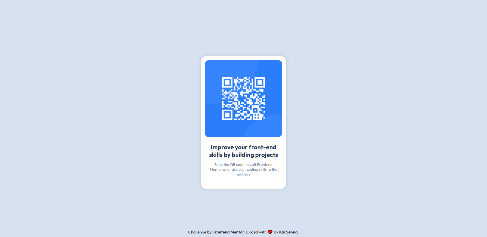

# 💻 QR Code Component

This is a solution to the [QR code component challenge on Frontend Mentor](https://www.frontendmentor.io/challenges/qr-code-component-iux_sIO_H).

## ❓ The challenge

Users should be able to:

- View the optimal layout depending on their device's screen size

## 📸 Screenshots

## 🔗 Links

- [Solution URL](https://www.frontendmentor.io/solutions/nft-preview-card-component-using-css-flexbox-HJVddKSB5)
- [Live Site URL](https://qr-code-component-846.pages.dev/)
